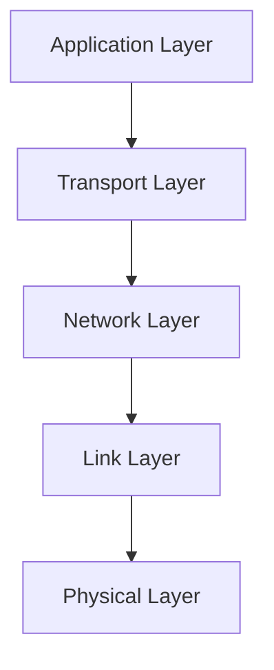

import { Card, Aside, Timeline, Steps, Button, Spoiler, FormattedDate, Collapse } from 'astro-pure/user'

# Introduction

## Roadmap

- **Internet**: Network 的 network
- **Protocol**: 定義的訊息傳送 format, order，全世界通用

## Network edge

- **Host**: Client, Server (end system)

### Cable-based
- **FDM**: Frequency Division Multiplexing，有線傳輸通常用「頻率」來做多工處理，通常使用
- 是一種 Share network，Cable 雖然很大但會被大家分掉
    - **HFC**: hybrid fiber coax，40Mbps ~ 1.2Gbps downstream, 30 ~ 100 Mbps upstream

### DSL
- 單戶用傳輸不遠，但 cable 比較小

### Wireless
- Wifi
- 4G, 5G

### Host
- Packet 必須完整才能傳出
- Sending packets, 每個 packets 的長度 $L$
- Transmit packets, 這條 link 的 transmit rate 是 $R$
$$
\text{packet transmit delay} = \frac{L\ (\text{bits})}{R\ (\text{bits/sec})}
$$
    - 經過 $N$ 個 router 傳送就會延遲

$$
d_{\text{e2e}} = \sum_{i=1}^N \frac{L}{R} = N\frac{L}{R}
$$

<Aside type="tip" title="Example">
如果經由 $N$ 個 router 傳送 $P$ 個 packet 會花
$$
d_{\text{e2e}}= \underset{\text{第一個 packet}}{\underbrace{\sum_{i=1}^N \frac{L}{R}}} + \underset{\text{後面 }P-1}{\underbrace{(P-1)\frac{L}{R}}} = (N + P -1) \frac{L}{R}
$$
</Aside>

### Link
- 分爲 Guided 跟 Unguided
    - Guided: Solid media Fiber(光纖), Coax(銅線傳輸)
    - Unguided: Radio
- TP (Twisted Pair): 雙絞線，可以減少干擾
- Radio link:
    - Wireless LAN (Wifi)
    - wide-area (4G)
    - Bluetooth

## Network Core
- **Forwarding**: Local action 只在自己身上作用，從正確接口接收封包再從正確出口送出
    - Forwarding table 用來確認送出的方向
- **Routing**: Global action 在所有 core 上都會作用，決定送出的 **source**, **destination**
    - 使用 routing algorithm

### Packet-switching
- Core 除了會 forward 還有 store 功能，為了要讓送出的 packet 完整
- Great for bursty (突發) data，data 來的不頻繁大家可以共用
- 可能會發生 Congestion 導致 Loss 或 Queue

<Aside type="note" title="Queueing delay">

  
   
  
     Packet-switching
  

- Ether net 傳輸到家裡的 transmit 非常快，Access link 傳輸出去很慢就會發生 queuing
- Router 可能會在這個 queuing 過程中發生 **Packet Loss**，因為他還要持續接收其他 packet
</Aside>

### Circuit-switching
- 不會發生 Queuing 或是 Loss 因為有預先留了傳輸管道
- Guarantee 一定有完整的一條 path 上面不會有其他人（圖例：四條中保證一條為空）
    - 如果你那段沒有用到，其他人也不能用
    - Inefficient
    - 

        
         
        
           Circuit-switching
        
      

### FDM vs TDM
- **FDM**
    - 完整使用那個頻段
    

      
       
      
         FDM vs TDM 1
      
    

-**TDM**
    - Sharing，但頻寬 (bandwidth) 大，只要在自己的 time slot 都可以用
    - 

        
         
        
           FDM vs TDM 2
        
      

<Aside type="tip" title="Example">

  
   
  
     FDM vs TDM 3
  

- **Circuit switch**: 10 user
- **Packet switch**: 35 user，user > 10 位的機率遠遠小於 0.0004 

選擇是一種風險管理
</Aside>

### Structure
- 如果每個人都用互相連結的話，那成本將會極高
$$
    \sum_{k\ \in\ \text{Host}} k = O(N^2)
$$
- **ISP**: Host 會用 Global **ISP** (Internet Services Provider) 連接 Internet
    - ISP 之間也會互相連接
    - Global ISP 會跟 Regional ISP 連接
- **IXP**: Internet exchange point (**IXP**) 會把 ISP 互相連接
    - 不可能讓 ISP 全部掌握在誰手裡，所以每個地區有自己的 ISP
- **CPN**: 大公司也會需要自己的 Global ISP 我們稱為 Content Provider Network (**CPN**)

  
   
  
     Structure 1
  

- **Tier-1**: Commercial ISPs (National or International)

  
   
  
     Structure 2
  

## Performance
也就是分析各種 delay 來源

### Packet delay

  
   
  
     Packet delay
  

- $d_{\text{proc}}$: Processing delay (typically < microsec)
    - 檢查 forwarding table
    - forwarding 過程
    - Integrity Check
- $d_{\text{queue}}$: Queuing delay
    - Congestion
- $d_{\text{trans}}$: Transmission delay
    - $\frac{L}{R}$
- $d_{\text{prop}}$: Propagation delay
    - $d$ : length of physical link
    - $s$ : propagation speed
    - $d_{\text{prop}} = \frac{d}{s}$

<Aside type="note" title="Queuing Delay">
$$
\text{traffic intensity} = \frac{L \cdot a}{R}
$$
> - $a$ : average packet arrival rate
> - $L$ : packet length
> - $R$ : link bandwidth (transmit rate)
- $La/R \to 0$ : small queuing delay
- $La/R \to 1^-$ : queuing delay large
- $La/R > 1$ : 收的資料太多了，無限 delay
</Aside>

**`traceoute`**
- Return 到每個 router 的 $RTT$ ，可以藉由設定每個 request 設定 `ttl = ?`（Time To Live）
- `* * *` 表示 no response
- format 是 `128.119.3.154 (128.119.3.154) 0.931 ms 0.441 ms 0.651 ms`

### Throughput
- **Instantaneous throughput**: 瞬時收到的資料量
- **Average throughput**: 平均收到的資料量
- 在這個簡單的 pipe 裡面，前者速率 $R_S$，後者則為 $R_C$
    - 如果 $R_S > R_C$ 那 Client 感受到的會是 $R_C$ 的傳輸速度，反之亦然
    - 因此一個網路線路的 Throughput 取決於最慢的那條，我們稱這條 link 為 **bottleneck link** (瓶頸線路)

  
   
  
     Throughput 1
  

- 在一條正常的網路裡 Bottleneck link 為 $\ell_B$
$$
\ell_B = \arg \min_{i\ \in\ \{1,2,...,n\}} R_i
$$

  
   
  
     Throughput 2
  

    - 而他的速率就是 $R_B$
$$
R_B = \min_{i\ \in\ \{1,2,...,n\}} R_i
$$
- 真實情況還會有這種共用 pipe 的情況，所以我們還要再考慮
$$
R = \min \{R_s, R_c, \frac{R}{N}\}
$$

  
   
  
     Throughput 3
  

    - 真實情況中 $\frac{R}{N} > R_c, R_s$，bottleneck 通常都是 edge link
    
## Layering, Encapsulation
- 複雜的系統常常需要做 layering 的工作
    - 便於了解每個 system pieces 之間的 relationship
    - 對 system 做了 modularization 便於維護（像是當我們要改變 server implement 我們不需要改變 inference）
- Layering 時我們會把這個結構叫做 protocol stack 因為他是一層一層解讀/封裝的

### Layered Internet Protocol tack

- **Application layer (應用層)**: 實現網路功能，對下層發送 **message** packet
    - HTTP, SMTP, DNS
- **Transport layer (傳輸層)**: 在 application endpoint 之間傳送訊息，發送 **segment** packet (process to process)
    - TCP, UDP
- **Network layer (網路層)**: 在 host 之間傳送資料，並不保證 reliable transfer 發送 **datagram** packet (host to host)
    - IP, routing protocol
- **Link layer (連結層)**: 發送 **frame** packet 把資料送到下一個節點後，讓下一個節點的 link layer 往上送給 Network layer
    - Wifi, Ethernet, PPP
- **Physical layer (物理層)**: 真正的傳輸，把一個一個 bit 傳送過去下一個節點

### Services, Layering, Encapsulation

  
   
  
     Services, Layering, Encapsulation
  

- 每個 layer 會在 Application layer 的 message 前面加上自己需要辨識用的 header 這個過程稱為 Encapsulation
    - 例如 Transport layer 會在 header 中加入他屬於哪個 process，Network layer 會加上 Destination
- 到了 destination 後一層一層的解讀最終在正確地方獲得正確資料，這個解讀 header 的過程叫 Decapsulation

<Aside type="note" title="">
有些 node 不一定需要解讀所有 header
  - **Switch** 功能只有要解讀 link layer 他就知道要傳到哪了
  - **Router** 只要知道 network layer 裡面的 destination
</Aside>

## Security

### Packet "sniffing"
- 此處的 C 可以讀到所有 B 要傳送到其他地方的 packet

  
   
  
     Packet "sniffing"
  

- Wireshark 就是一款免費的 packet-sniffer

### IP Snoofing
- 對 packet 進行操作，此處 C 假裝自己 send 的 packet 是 B 來的

  
   
  
     IP Snoofing
  

### Denial of Service (DoS)
- 生成很多假的 http request 讓 server 癱瘓掉
    1. 選擇目標
    2. 侵入很多 host
    3. 從侵入成功的 host 端發送爆量訊息到 server

### Defense
- Authentication
- Confidentiality: encryption
- Integrity Check
- Access Restriction
- Firewalls

---

<Card
  as='a'
  href='/notes/cn'
  heading='Back to the content'
  subheading='NTU Computer Networking'
  date='2025 Fall'
>
  ← Back to the content
</Card>

---
